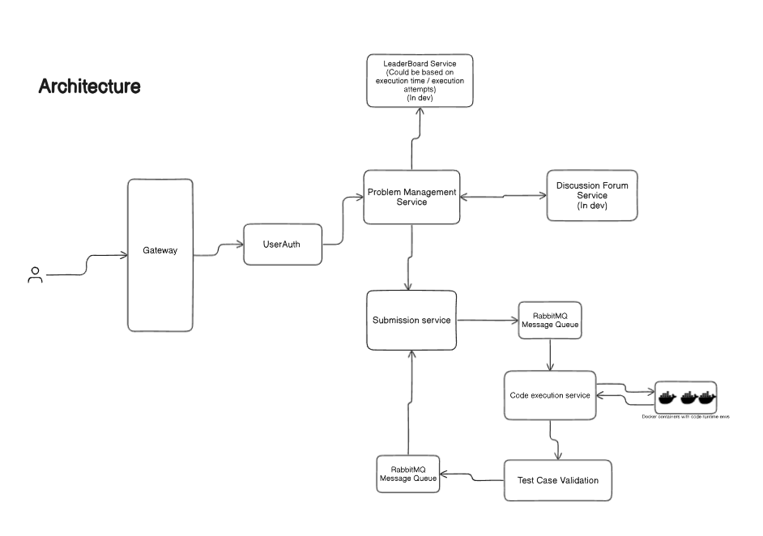

# CodeVerse - LeetCode Clone

CodeVerse is a microservices-based online coding platform where users can practice coding problems, submit solutions, and receive real-time execution feedback. The system efficiently handles authentication, problem management, code submissions, and secure code execution using containerized environments.

## Features

- Authentication & Authorization: JWT-based authentication with a proxy middleware.
- Problem Management: REST APIs for problems, test cases, and metadata.
- Code Submission & Execution: Asynchronous execution with RabbitMQ, real-time updates via WebSocket.
- Secure Code Execution: Dockerized execution with test case validation and non-root execution.

## Architecture

The system follows a microservice architecture with four core services:

| Service | Tech Stack | Deployment |
|---------|-----------|------------|
| [Auth Service](auth-svc/README.md) | Golang, PostgreSQL, Gin, Gorm | Render |
| [Problem Management Service (PMS)](pms-service/README.md) | Spring Boot, Hibernate, PostgreSQL | Render |
| [Submission Service](submission-service/README.md) | Golang, RabbitMQ, WebSocket | Render |
| [Code Execution Service](code-execution-service/README.md) | Golang, Docker SDK, RabbitMQ | AWS EC2 |

### External Services
- Database: Supabase (PostgreSQL)
- Message Queue: LavinMQ (RabbitMQ Cloud)

## Workflow

1. **User Authentication**: Requests go through the Auth Service, which verifies JWT tokens before forwarding them to the respective services.
2. **Problem Management**: The PMS exposes APIs to manage problems and test cases.
3. **Code Submission**: The Submission Service handles user submissions, publishes messages to RabbitMQ, and manages WebSocket updates.
4. **Code Execution**: The Code Execution Service consumes requests, spins up Docker containers for execution, retrieves test cases from PMS, evaluates code, updates results, and sends real-time updates.

## Setup

Each service has its own setup instructions. Refer to the specific service README:
- [Auth Service Setup](auth-service/README.md)
- [Problem Management Service Setup](pms-service/README.md)
- [Submission Service Setup](submission-service/README.md)
- [Code Execution Service Setup](code-execution-service/README.md)

